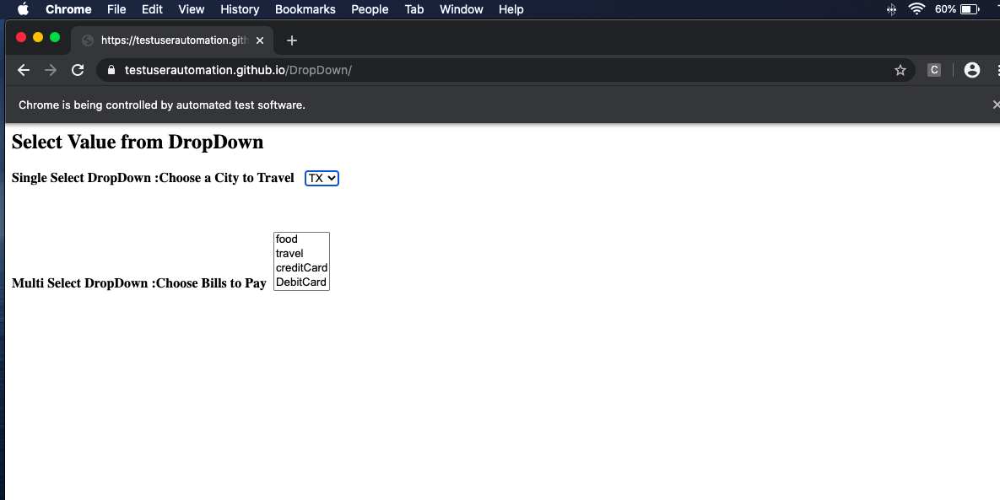
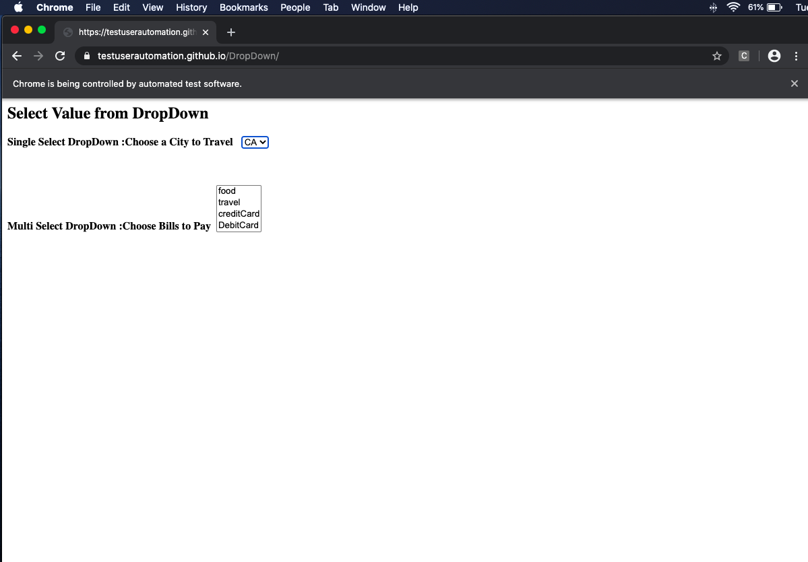
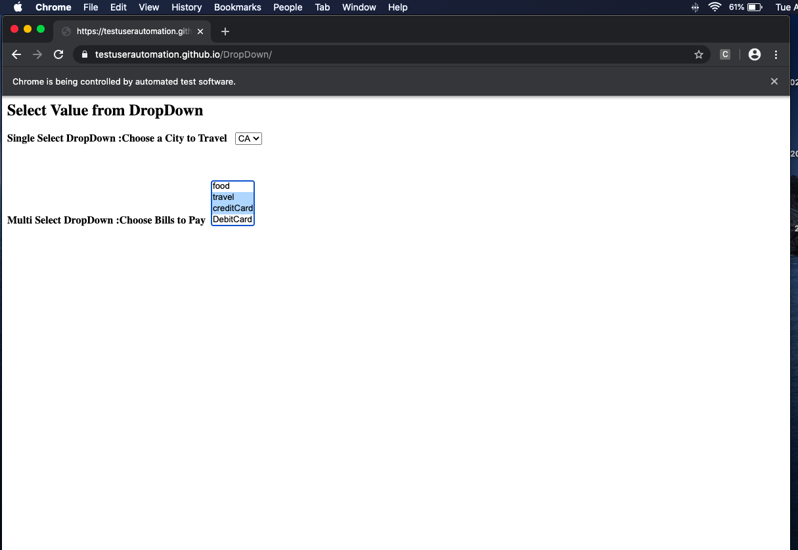
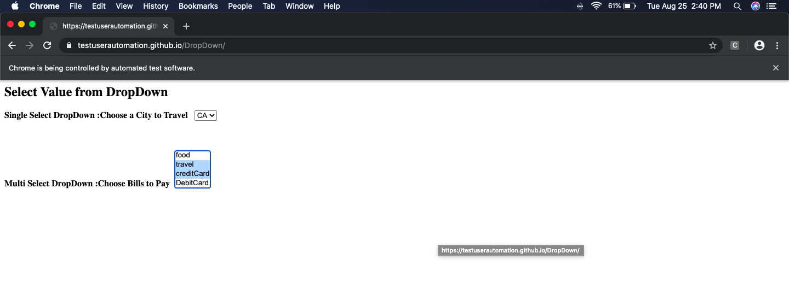
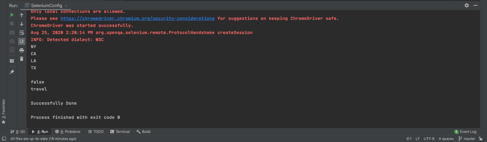

<h2> Handle DropDown using select class in Selenium </h2>

Platform supporting Maven: [IntelliJ IDEA CE](https://www.jetbrains.com/idea/download/download-thanks.html?platform=mac&code=IIC)

1. Create a new Project

2. Choose [Maven](https://en.wikipedia.org/wiki/Apache_Maven#:~:text=Maven%20is%20a%20build%20automation,%2C%20Scala%2C%20and%20other%20languages.&text=Maven%20is%20built%20using%20a,application%20controllable%20through%20standard%20input.)

3. In Project SDK box, make sure you have latest version of java "JDK"

<p align="center">
	
</p>

4. Click Next, and give a name to your project, like "DropdownProj"

5. Now create a package inside src/test/java/ and name it "Dopdown" then create a class inside it, name it "DropDownTest", and we also need to create a main class, name it "JavaMail"


<h4> What is Maven? </h4>

"Maven is a build automation tool used primarily for Java projects. Maven can also be used to build and manage projects written in C#, Ruby, Scala, and other languages.

Maven addresses two aspects of building software: how software is built, and its dependencies. An XML file describes the software project being built, its dependencies on other external modules and components, the build order, directories, and required plug-ins. It comes with pre-defined targets for performing certain well-defined tasks such as compilation of code and its packaging. 

Maven dynamically downloads Java libraries and Maven plug-ins from one or more repositories such as the Maven 2 Central Repository, and stores them in a local cache. Maven projects are configured using a Project Object Model, which is stored in a [pom.xml](https://github.com/kk289/Java-Handle-DropDown-using-Selenium/blob/master/pom.xml) file."

An example of [pom.xml](https://github.com/kk289/Java-Handle-DropDown-using-Selenium/blob/master/pom.xml) file looks like: 

```
<?xml version="1.0" encoding="UTF-8"?>
<project xmlns="http://maven.apache.org/POM/4.0.0"
         xmlns:xsi="http://www.w3.org/2001/XMLSchema-instance"
         xsi:schemaLocation="http://maven.apache.org/POM/4.0.0 http://maven.apache.org/xsd/maven-4.0.0.xsd">
    <modelVersion>4.0.0</modelVersion>

    <groupId>org.example</groupId>
    <artifactId>OpenBrowser</artifactId>
    <version>1.0-SNAPSHOT</version>

    <properties>
        <project.build.sourceEncoding>UTF-8</project.build.sourceEncoding>
        <maven.compiler.source>1.7</maven.compiler.source>
        <maven.compiler.target>1.7</maven.compiler.target>
    </properties>

    <dependencies>

	    <!-- https://mvnrepository.com/artifact/org.seleniumhq.selenium/selenium-java-->
        <dependency>
            <groupId>org.seleniumhq.selenium</groupId>
            <artifactId>selenium-java</artifactId>
            <version>3.141.59</version>
            <scope>test</scope>
        </dependency>

        <!-- https://mvnrepository.com/artifact/org.seleniumhq.selenium/selenium-api -->
        <dependency>
            <groupId>org.seleniumhq.selenium</groupId>
            <artifactId>selenium-api</artifactId>
            <version>3.141.59</version>
            <scope>test</scope>
        </dependency>

         <!-- https://mvnrepository.com/artifact/javax.mail -->
        <dependency>
            <groupId>javax.mail</groupId>
            <artifactId>mail</artifactId>
            <version>1.5.0-b01</version>
            <scope>test</scope>
        </dependency>

    </dependencies>

</project>
```

9. Make sure to setup your "pom.xml" file like above. Just replace your pom.xml file with this [pom.xml](https://github.com/kk289/Java-Handle-DropDown-using-Selenium/blob/master/pom.xml)

10. Let's look at "DropDownTest" class:

## DropDownTest

```
package DropDown;

import org.openqa.selenium.By;
import org.openqa.selenium.WebDriver;
import org.openqa.selenium.WebElement;
import org.openqa.selenium.chrome.ChromeDriver;
import org.openqa.selenium.support.ui.Select;
import java.util.List;

public class DropDownTest {

    public static void main(String[] args) throws InterruptedException {

        String path = System.getProperty("webdriver.chrome.driver", "/usr/local/bin/chromedriver");

        WebDriver driver = new ChromeDriver();
        driver.get("https://testuserautomation.github.io/DropDown/");

        //inspect over the Drop Down menu
        WebElement selectCitiesObj = driver.findElement(By.xpath("//select[@name='Cities']"));
        Select selectFromDropDownObj = new Select(selectCitiesObj);

        //select by index , index will start from 0 for first value
        selectFromDropDownObj.selectByIndex(0);
        // Wait for 2 sec
        Thread.sleep(2000);

        //select by value, value to be found in HTML DOM
        selectFromDropDownObj.selectByValue("Texas");
        // Wait for 3 sec
        Thread.sleep(3000);

        //select by Text given in the dropDownList
        selectFromDropDownObj.selectByVisibleText("CA");
        // Wait for 3 sec
        Thread.sleep(3000);

        //getOptions : to get all the options from the drop-down
        List <WebElement> allOptionsObj = selectFromDropDownObj.getOptions();

        for (WebElement getAllOptions : allOptionsObj)
            System.out.println(getAllOptions.getText());

        // For "Multi Select DropDown :Choose Bills to Pay"
        //isMultiple : Is it multi select drop-down if no then it returns false:
        boolean isSuccess = selectFromDropDownObj.isMultiple();
        System.out.println("\n" + isSuccess);

        //MultiSelect DropDown at Once
        WebElement selectBillsObj = driver.findElement(By.xpath("//select[@id='Bill']"));
        Select selectBillFromDropDownObj = new Select(selectBillsObj);
        selectBillFromDropDownObj.selectByValue("Travel");
        System.out.println(selectBillFromDropDownObj.getFirstSelectedOption().getText());
        selectBillFromDropDownObj.selectByIndex(2); // Select CreditCard
        //selectBillFromDropDownObj.selectByIndex(3); // Select DebitCard

        // Print a Log In message to the screen
        System.out.println("\nSuccessfully Done");

        // Maximize Browser
        driver.manage().window().maximize();

        // Wait for 5 sec
        Thread.sleep(5000);

        // Close the browser
        driver.close();
    }
}
```

Let's run the "DropDownTest" class. We get following result: 

<p align="center">
	
	<br>
	<br>
	
	<br>
	<br>
	
	<br>
	<br>
	
	<br>
	<br>
	
</p>

<br>

<b>The program run successfully. Thank you. Let me know if you have any questions.</b>

